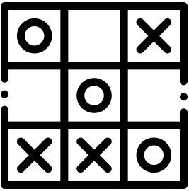

<br />
<p align="center">
  <a href="https://github.com/AbdizamedAli/Noughts&Crosses">
    
  </a>

  <h3 align="center">Noughts & Crosses</h3>

  <p align="center">
    Implementation of the popular game noughts and crosses with an AI using reinforcement learning
    <br />
    <a href="https://github.com/AbdizamedAlipo_name"><strong>Explore the docs »</strong></a>
    <br />
    <br />
    <a href="https://github.com/AbdizamedAlipo_name/issues">Report Bug</a>
    ·
    <a href="https://github.com/AbdizamedAli/Noughts&Crosses/issues">Request Feature</a>
  </p>
</p>


<!-- TABLE OF CONTENTS -->
<details open="open">
  <summary><h2 style="display: inline-block">Table of Contents</h2></summary>
  <ol>
    <li>
      <a href="#about-the-project">About The Project</a>
      <ul>
      </ul>
    </li>
    <li>
      <a href="#getting-started">Getting Started</a>
      <ul>
        <li><a href="#prerequisites">Prerequisites</a></li>
        <li><a href="#installation">Installation</a></li>
      </ul>
    </li>
  </ol>
</details>


<!-- ABOUT THE PROJECT -->
## About The Project
This is an implementation of the game noughts and crosses using pygame with an AI that implements a Bellman function to determine the best move. The program may take awhile to load up as it will begin its learning iterations you can change this in the main function it is set to 100,000 currently


<!-- GETTING STARTED -->
## Getting Started

To get a local copy up and running follow these simple steps.

### Prerequisites

This is an example of how to list things you need to use the software and how to install them.
* pygame
  ```sh
  pip3 install pygame
  ```

### Installation

1. Clone the repo
   ```sh
   git clone https://github.com/AbdizamedAli/Noughts&Crosses.git
   ```


## Usage
1. Start up game 
   ```sh
   python3 main.py
   ```


